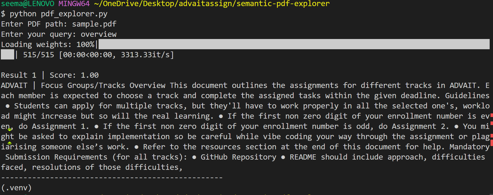

# Semantic PDF Explorer

## Objective

Build an AI-powered tool to search and retrieve relevant information from PDF documents using **Hugging Face Transformers**.

---

## Overview

Semantic PDF Explorer is a command-line tool that allows users to query a PDF and retrieve the most relevant sections based on meaning, not just keywords.
It leverages **zero-shot classification** to perform semantic matching between user queries and document content.

---

## Approach

The system follows a structured pipeline:

1. **Text Extraction**
   Extract text from PDF using `pypdf`.

2. **Text Chunking**
   Split extracted text into smaller chunks (~150 words each) for efficient processing.

3. **Model Loading**
   Load a pre-trained transformer model (`facebook/bart-large-mnli`) using Hugging Face.

4. **Semantic Matching**
   Compare each chunk with the user query using zero-shot classification.

5. **Filtering**
   Retain only chunks with confidence score ≥ **0.8**.

6. **Ranking & Output**
   Sort results by relevance and display the top matches.

---

## Pipeline Explanation

PDF → Text Extraction → Chunking → Zero-Shot Classification → Filtering (≥ 0.8) → Ranked Results

Zero-shot classification allows the model to match queries with text without any additional training. **without any task-specific training**.

---

## Sample Usage

### Input

```
Enter PDF path: sample.pdf
Enter your query: overview
```

### Output

```
Total relevant chunks found: 1

Result 1 | Score: 1.00
ADVAIT | Focus Groups/Tracks Overview This document outlines the assignments for different tracks in ADVAIT. Each member is expected to choose a track and complete the assigned tasks within the given deadline. Guidelines ● Students can apply for multiple tracks, but they'll have to work properly in all the selected one's, workload might increase but so will the real learning. ● If the first non zero digit of your enrollment number is even, do Assignment 1. ● If the first non zero digit of your enrollment number is odd, do Assignment 2. ● You might be asked to explain implementation so be careful while vibe coding your way through the assignment or plagiarising someone else’s work. ● Refer to the resources section at the end of this document for help. Mandatory Submission Requirements (for all tracks): ● GitHub Repository ● README should include approach, difficulties faced, resolutions of those difficulties,
```
## Screenshot


---

## Difficulties Faced

* Extracting clean and consistent text from PDFs
* Choosing optimal chunk size for better model performance
* Initial delay due to model loading
* Selecting an appropriate confidence threshold

---

## Solutions Implemented

* Ignored empty or invalid text during extraction
* Used chunk size of ~150 words for balanced context
* Leveraged pre-trained transformer model (no training required)
* Set threshold = **0.8** to ensure high-quality results

---

## Learnings

* Practical usage of **Hugging Face Transformers**
* Understanding of **zero-shot classification**
* Importance of preprocessing in NLP pipelines
* Building a real-world AI-powered search system

---

## How to Run

### 1. Install dependencies

```
pip install transformers torch pypdf
```

### 2. Run the script

```
python pdf_explorer.py
```

### 3. Provide input

* Enter the path to your PDF file
* Enter your query

---

## Constraints Satisfied

*  Used Hugging Face Transformers
*  Implemented zero-shot classification
*  CLI/script-based solution

---

## Future Improvements

- Convert into a web application  
- Use embeddings + vector search (FAISS)  
- Support multiple PDFs

---

## Note

This project works with **any PDF file**.
Users can provide their own PDF path at runtime.

---